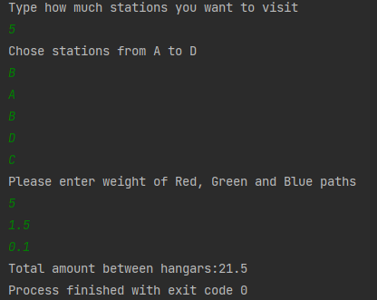

# Rekrutacja-zadanie2

Celem zadania jest wyznaczenie drogi robota przy minimalnym zużyciu energii na danych odcinkach. Każdy typ drogi (czerwony, zielony, niebieski) ma swój koszt przejechania na każdym odcinku. Do celów diagnostycznych koszt czerwonej ścieżki = 5, zielonej = 1.5, niebieskiej = 0.1. Program wykorzystuje algorytm Dijksty do odnajdywania najkrótszej trasy zaczerpnięty ze strony <a href="https://algotree.org/algorithms/single_source_shortest_path/dijkstras_shortest_path_c++/">link</a>.

<ol>
   <h2><li>Rozrysowanie grafu</h2>
  
Pierwszym krokiem było rozpisanie grafu dla wszystkich tras. Graf prezentuje się następująco:

   

</li>
   <h2><li>Zasada działania algorytmu</h2>
      
Program posługuje się algorytmem Dijkstry do odnajdowania najkrótszej ścieżki.
         Jako pierwsze zakładam, że wszystkie odległości od wszystkich punktów poza startowym wynoszą nieskończoność.
         Tworzymy wektor, który przechowuje odległości od pkt wyjściowego wraz z aktualnym punktem.
         Zwalniamy utworzoną parę i porównuję długości ścieżek tworząc kolejne pary tak jak wyżej. Badane są wszystkie kombinacje wyjściowe od początkowego punktu.
         Kolejno są brane pod badanie następne pary w wektorze i badane wszystkie ścieżki.
         Proces trwa do całkowitego zwolnienia wektoraz utworzonych par.
         W trakcie wykonywania funkcji w przypadku znalezienia krótszej ścieżki zostaje ona zastąpiona w tablicy dist[].
         Na samym końcu jest zwracana odległość do konkretnego wierzchołka który jest badany.
</li>
    <h2><li>Sprawdzenie poprawności wykonania algorytmu na grafie</h2>
      
Dla danych r=5, g=1.5, b=0.1, dla danego ciągu BABDC program powinien zwracać wartość 21,5. Następnie sumując długości ścieżek sprawdzam zgodność z rozwiązaniem.

   

   

   

   

</li>
   
W programie dla podanych wartości diagnostycznych wyniki się pokrywają

   

</ol>
   
   
